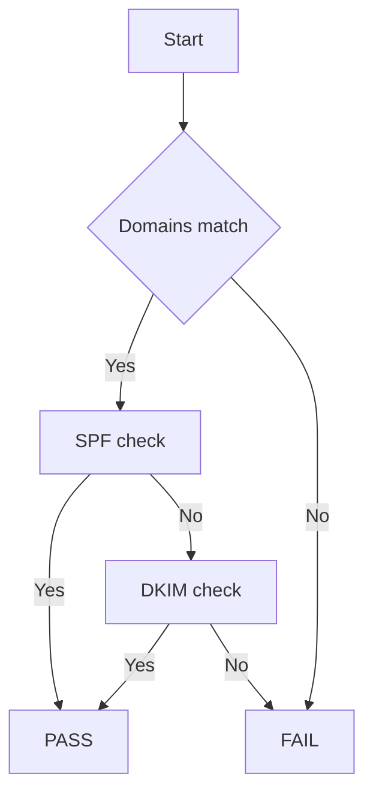
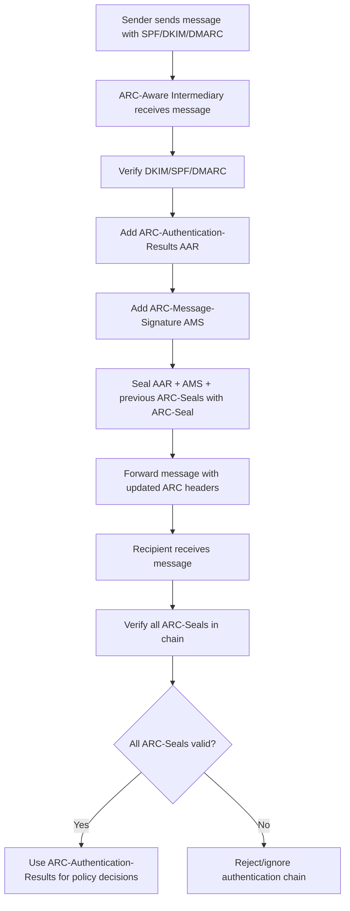
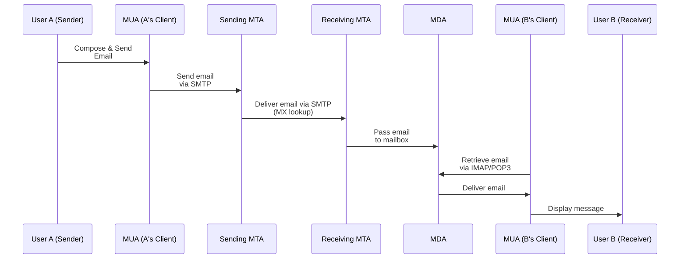

# Email Verification Protocols Now

## SPF (Sender Policy Framework)

https://datatracker.ietf.org/doc/html/rfc7208

* `MAILFROM` set by SMTP email sender
* `IP`

SMTP email receiver queries the SPF record for the `MAIL FROM` domain and checks that `IP` is authorized.

SPF record example for [mail.provable.dev](https://dns.google/resolve?type=TXT&name=mail.provable.dev)

## DKIM (DomainKeys Identified Mail)

* https://datatracker.ietf.org/doc/html/rfc6376

### Required DKIM Signature Tags

| Tag  | Name           | Description                                                                                          |
| ---- | -------------- | ---------------------------------------------------------------------------------------------------- |
| `v`  | Version        | `1` for rfc6376                                                                                 |
| `a`  | Algorithm      | The cryptographic algorithm used to generate the signature, e.g. `rsa-sha256` or `ed25519-sha256`.   |
| `b`  | Signature      | The actual Base64-encoded digital signature (generated using the private key).                       |
| `bh` | Body Hash      | Base64-encoded hash of the canonicalized body; used to verify the body wasn't modified.              |
| `d`  | Domain         | SDID: the signing domain (`d=`) whose DNS contains the public key under `selector._domainkey.domain` (e.g. [2024a._domainkey.mail.provable.dev](https://dns.google/resolve?type=TXT&name=2024a._domainkey.mail.provable.dev))      |
| `h`  | Signed Headers | A colon-separated list of headers that were signed (in order), e.g. `from:to:subject`.               |
| `s`  | Selector       | Indicates the DNS record selector under `_domainkey`, e.g. `s=2024a` → `2024a._domainkey.mail.provable.dev` (e.g. [2024a._domainkey.mail.provable.dev](https://dns.google/resolve?type=TXT&name=2024a._domainkey.mail.provable.dev). |

### Optional DKIM Signature Tags

| Tag | Name                       | Description                                                                                                 |
| --- | -------------------------- | ----------------------------------------------------------------------------------------------------------- |
| `c` | Canonicalization Algorithm | Header/body canonicalization, e.g. `relaxed/relaxed`, `simple/simple`. Default is `simple/simple`.          |
| `i` | Identity                   | AUID (User identifier), e.g. `i=@example.com` or `i=user@example.com`. Must be a subdomain or exact match of `d=`. |
| `l` | Body Length Count          | Number of body bytes hashed (used for partial signing). Rarely used.                                        |
| `q` | Query Method               | How to retrieve the public key. Usually just `dns/txt`. Deprecated and ignored by most systems.             |
| `t` | Timestamp                  | Integer (Unix timestamp) when the signature was created.                                                    |
| `x` | Expiration                 | Integer (Unix timestamp) after which the signature is no longer valid.                                      |
| `z` | Copied Headers             | Original headers (folded) to aid debugging; optional and rarely used.                                       |

### `h=` signed headers

* required: `From`
* recommended: `From:To:Cc:Subject:Date:Message-ID:Content-Type:Content-Transfer-Encoding`


```email
DKIM-Signature: v=1;
  d=mail.provable.dev;
  s=2024a;
  i=test@mail.provable.dev;
  a=ed25519-sha256;
  t=1749589922;
  x=1749849122;
  h=From:To:Cc:Bcc:Reply-To: References:In-Reply-To:Subject:Date:Message-Id:Content-Type:From:To:Subject: Date:Message-Id:Content-Type;
  bh=4fWAjR8dybJoJ7oc+ua358Qnylv7LASFrox6UiJwQ8g=;
  b=7J39El5KDL4NPguv2fK3m7xm/F
    evJN9QFqECm90XGwfWnlqBEEjHteY/P28AJ5xwfenf08TdtBLIMes6PMZTBA==
DKIM-Signature: v=1;
  d=mail.provable.dev;
  s=2024b;
  i=test@mail.provable.dev;
  a=rsa-sha256;
  t=1749589922;
  x=1749849122;
  h=From:To:Cc:Bcc:Reply-To: References:In-Reply-To:Subject:Date:Message-Id:Content-Type:From:To:Subject: Date:Message-Id:Content-Type;
  bh=4fWAjR8dybJoJ7oc+ua358Qnylv7LASFrox6UiJwQ8g=;
  b=K043WB+2sby57d3sihT+xRSou8
    H2+XTKqUxrfBRaOa6q48hcUs7DVg9n+0bA6T7cAQYlNsc1MNoViH5ebdjYKigJepnwrh4CCGweJUZ
    plhBWUF2McU4Kgz8XaLyCt5ipots2aOLRG7yT0FkudXYBY2bnG64fbyQABf6LClIF9Gwuq8gNF5Mj
    YF+oZZCZdnsQnf/AT+qDYCjOgTbjoPosZDOypsHSu42/m12UsYEqAZsBrsqaFV1rmFLlpdWzQ8y41
    dySACyWpRiVayzU5vFvfBkd/juhG94xlER9cs8RLE/oeFXqtOqq21HDUfqLp3koxqOeHTgmctN/0r
    BI+nuopA==
```

Allows the sender's mail server to digitally sign email messages using their domain's private key. The recipient’s mail server can then verify the signature using the public key published in DNS, ensuring:
* The email was not altered in transit.
* It was authorized by the domain it claims to be from.

## DMARC (Domain-based Message Authentication, Reporting and Conformance)

* https://datatracker.ietf.org/doc/html/rfc7489

### Flow



1. Check [DKIM signature](#dkim-domainkeys-identified-mail)
2. Check [SPF](#spf-sender-policy-framework)
3. Check alignment (*required). Domains must match:
    * [`header.From`](#from) domain
    * [DKIM](#dkim-domainkeys-identified-mail) `d=` domain
    * [SPF](#spf-sender-policy-framework) `MAILFROM` domain

If alignment (3) + one of SPF (2) or DKIM (1) passes → DMARC passes

## ARC (Authenticated Received Chain)

* https://datatracker.ietf.org/doc/html/rfc8617
* https://arc-spec.org/

### Flow

Preserves the results of email authentication checks (SPF, DKIM, DMARC) as a message passes through intermediaries (like mailing lists or forwarders) that might otherwise break those checks — enabling the final recipient to make informed trust decisions even if the message has been modified.




### ARC-Authentication-Results

* https://datatracker.ietf.org/doc/html/rfc8617#section-4.1.1

General syntax: `method = result (comment) [ kv-pairs ]`
* `method`: e.g., dkim, spf, dmarc
* `result`: one of the defined values
* `comment`: optional human-readable info
* `kv-pairs`: optional, like header.i=...

#### Common Methods and Fields

| Method          | Meaning                                      | Example                                        |
| --------------- | -------------------------------------------- | ---------------------------------------------- |
| `dkim`          | DKIM signature validation result             | `dkim=pass header.i=@example.com`              |
| `spf`           | SPF result for SMTP envelope sender          | `spf=fail smtp.mailfrom=bad.example.com`       |
| `dmarc`         | DMARC result (based on SPF & DKIM alignment) | `dmarc=pass header.from=example.com`           |
| `arc`           | ARC chain validation result                  | `arc=pass (i=1 spf=pass dkim=pass dmarc=pass)` |
| `iprev`         | Reverse DNS validation                       | `iprev=pass policy.iprev=203.0.113.1`          |
| `auth`          | Authentication status                        | `auth=pass smtp.auth=user@example.com`         |
| `smtp.mailfrom` | The domain in the `MAIL FROM` envelope       | `smtp.mailfrom=example.com`                    |
| `header.from`   | The domain in the `From:` header             | `header.from=example.com`                      |

#### Possible Results (for each method):
| Result      | Meaning                               |
| ----------- | ------------------------------------- |
| `pass`      | Authentication succeeded              |
| `fail`      | Authentication failed                 |
| `neutral`   | Indeterminate / ambiguous result      |
| `none`      | No data / method not applied          |
| `temperror` | Temporary error                       |
| `permerror` | Permanent error (e.g., malformed DNS) |


```email
ARC-Authentication-Results: i=3; mx.google.com;
    dkim=neutral (no key) header.i=@mail.provable.dev header.s=2024a;
    dkim=pass header.i=@mail.provable.dev header.s=2024b header.b=K043WB+2;
    arc=pass (i=2 spf=pass spfdomain=mail.provable.dev dkim=pass dkdomain=mail.provable.dev dmarc=pass fromdomain=mail.provable.dev);
    spf=pass (google.com: domain of thelaurel.bot+caf_=seth.one.info=gmail.com@gmail.com designates 209.85.220.41 as permitted sender) smtp.mailfrom="thelaurel.bot+caf_=seth.one.info=gmail.com@gmail.com";
    dmarc=pass (p=REJECT sp=REJECT dis=NONE) header.from=mail.provable.dev;
    dara=pass header.i=@gmail.com
```

### ARC-Message-Signature

* https://datatracker.ietf.org/doc/html/rfc8617#section-4.1.2

| Field | Description                                                                                    | Example                  | Required                        |
| ----- | ---------------------------------------------------------------------------------------------- | ------------------------ | ------------------------------- |
| `i`   | ARC instance number. Must match corresponding ARC-Seal and ARC-Authentication-Results headers. | `i=1`                    |Yes                           |
| `a`   | Signing algorithm used. Typically RSA or Ed25519 with a hash function.                         | `a=rsa-sha256`           |Yes                           |
| `c`   | Canonicalization algorithm for headers/body.                                                   | `c=relaxed/relaxed`      |No (default: `simple/simple`) |
| `d`   | Domain of the signer (signing domain).                                                         | `d=example.org`          |Yes                           |
| `s`   | Selector used to locate the public key in DNS.                                                 | `s=brisbane`             |Yes                           |
| `t`   | Signing timestamp (Unix seconds since epoch).                                                  | `t=1610000000`           |No                            |
| `h`   | List of signed headers, in the order they were signed.                                         | `h=from:to:subject:date` |Yes                           |
| `bh`  | Body hash (base64 of hash of canonicalized body).                                              | `bh=abcdefg...=`         |Yes                           |
| `b`   | Signature itself (base64). Must be empty (`b=`) at time of signing.                            | `b=abc123...`            |Yes                           |

### `h=` signed headers

* required: `From`
* recommended: cover sender's DKIM signature context; e.g. `From:To:Subject:Date:Message-ID:DKIM-Signature:Content-Type:Content-Transfer-Encoding:MIME-Version`

```email
ARC-Message-Signature: i=3;
    a=rsa-sha256;
    c=relaxed/relaxed;
    d=google.com;
    s=arc-20240605;
    h=content-transfer-encoding:mime-version:user-agent:date:message-id
        :subject:to:from:dkim-signature:dkim-signature:delivered-to;
    bh=4fWAjR8dybJoJ7oc+ua358Qnylv7LASFrox6UiJwQ8g=;
    fh=Ml91QZNjOUBF4lPxdodEISvnG8cKMzALenqeNxoWqdI=;
    b=VEGNq275dIibd6+54GYZnP2dIHqFiGkAwALj/FA4hw7weJGTiFvfcb/O7p20PPWbUY
        isM3m4twYpknpID3hRN/euJJNWqj4VgclnJST3nQ+F0WgfwBCOl/wuVJbu9pO9vgJAY7
        WglNuiona7FL0Rlwp+KGHllLbR5CA0pak3s9E+OI3fhZya9/v5Gldis8vzsyfOiCnGta
        5IYVB42Mgdi+tS2SaUaHqPUL+g9eo2hnca56CTkEieuOZcLFDcCOHQTZol4n8ti5aiiI
        UB2EKnu+PC1JX7Tm2MYYBbIRZhuB9OF2TQat13rr8Hph3I1/cupScIWFRr/8Hkh4PP0q
        9kUw==;
    dara=google.com
```

* cryptographically similar to `DKIM-Signature`, but the signed content has some differences.

Captures and cryptographically preserves the message’s authentication state (headers and body) as received by an intermediate system (like a forwarder or mailing list), before it modifies or relays the message.

### ARC-Seal

* https://datatracker.ietf.org/doc/html/rfc8617#section-4.1.3

| Field | Description                                                                                                     | Example         | Required |
| ----- | --------------------------------------------------------------------------------------------------------------- | --------------- | -------- |
| `i`   | ARC instance number. Must match the corresponding `i=` in ARC-Authentication-Results and ARC-Message-Signature. | `i=1`           | Yes    |
| `a`   | Algorithm used to generate the signature. Format: `<algorithm>-<hash>`.                                         | `a=rsa-sha256`  | Yes    |
| `d`   | Domain of the sealing entity (signer). Used with `s=` to retrieve the public key.                               | `d=example.org` | Yes    |
| `s`   | Selector used to locate the public key in DNS.                                                                  | `s=selector1`   | Yes    |
| `t`   | Signing timestamp (seconds since epoch).                                                                        | `t=1650000000`  | Yes    |
| `cv`  | Chain validation result for previous ARC sets. Values: `none`, `pass`, or `fail`.                               | `cv=none`       | Yes    |
| `b`   | Signature value (base64-encoded). Empty (`b=`) when computing the hash.                                         | `b=abc123...`   | Yes    |

#### CV

| Result | Description                   |
| ------ | ------------------------------|
| none | this is the first ARC set (i=1) |
| pass | all previous ARC sets validated |
| fail | if any prior ARC set failed     |

```email
ARC-Seal: i=3;
    a=rsa-sha256;
    t=1749589924;
    cv=pass;
    d=google.com;
    s=arc-20240605;
    b=k/DDEvhaKSwq1fjWM0FrkW5lbFEVRHln8sdi0ExNdxC5DX2e6Wcc+yDxxesyjpccS/
        H8f5Ii2NnZShlTB37lgzP0s8knWd0sLnqorv/EM9DaCU/jRPwcPN51k4TOdMZqxzCzUy
        MHPNZzTN1o4XomdeC2EP2gw90XdaYhzTlmwR6F4uRdU42uPTPfAxHQp7muQSqez8ptF+
        GC641X6SE9SrCMNdakyj14W85fhc6rRvTzf8itaD1Rl3W3BoYjulSGVoRSYWS16He3uT
        l6YR7/0sc0tAKKhLYdkwesc81qo65crK6Qc/4F3Xq1iS88+kDc9kqizrg0lT++PNfFgO
        BC0w==
```

* the canonicalization for ARC-Seal is always relaxed (c= is not specified).
* ARC-Seal signs over:
    * the current ARC-Authentication-Results
    * the current ARC-Message-Signature
    * all prior ARC-Seals (not including the current one)

## Headers

* topmost headers are most recent
* https://www.iana.org/assignments/message-headers/message-headers.xhtml
* header formatting: https://datatracker.ietf.org/doc/html/rfc5322#section-2.2.3 (Long header fields folding)

### `From`
* RFC: [RFC 5322](https://datatracker.ietf.org/doc/html/rfc5322)
* Purpose: Specifies the author of the message (the visible sender).
* Set by: Mail User Agent (MUA) or sender.

### `To`
* RFC: [RFC 5322](https://datatracker.ietf.org/doc/html/rfc5322)
* Purpose: Specifies the primary recipient(s) of the message.
* Set by: Sender or email client.

### `Subject`
* RFC: [RFC 5322](https://datatracker.ietf.org/doc/html/rfc5322)
* Purpose: Provides a summary or title of the message content.
* Set by: Sender.

### `Date`
* RFC: [RFC 5322](https://datatracker.ietf.org/doc/html/rfc5322)
* Purpose: Indicates the date and time at which the message was composed.
* Set by: Sending mail client.

### `Message-ID`
* RFC: [RFC 5322](https://datatracker.ietf.org/doc/html/rfc5322)
* Purpose: Provides a unique identifier for the message for threading and deduplication.
* Set by: Sending MUA or mail server.

### `Reply-To`
* RFC: [RFC 5322](https://datatracker.ietf.org/doc/html/rfc5322)
* Purpose: Indicates an alternate address for replies.
* Set by: Sender.

### `Sender`
* RFC: [RFC 5322](https://datatracker.ietf.org/doc/html/rfc5322)
* Purpose: Identifies the actual sender when From is a group or different role.
* Set by: Sender.

### `MIME-Version`
* RFC: [RFC 2045](https://datatracker.ietf.org/doc/html/rfc2045)
* Purpose: Indicates that the message uses MIME formatting.
* Set by: Mail client.

### `Content-Type`
* RFC: [RFC 2045](https://datatracker.ietf.org/doc/html/rfc2045)
* Purpose: Specifies the media type of the message body (e.g., text/plain, multipart).
* Set by: Mail client.

### `Content-Transfer-Encoding`
* RFC: [RFC 2045](https://datatracker.ietf.org/doc/html/rfc2045)
* Purpose: Indicates encoding used for the body content (e.g., base64, quoted-printable).
* Set by: Mail client.

### `Delivered-To`
* RFC: Not standardized in an RFC, but widely used.
* Purpose: Indicates the final mailbox address where the message was delivered.
* Set by: The receiving mail server.

### `Received`
* RFC: https://datatracker.ietf.org/doc/html/rfc5321, https://datatracker.ietf.org/doc/html/rfc5322
* Purpose: Tracks the path an email took from the sender to the recipient by listing each mail server that processed it.
* Set by: Each mail server in the delivery chain.

### `Return-Path`
* RFC: https://datatracker.ietf.org/doc/html/rfc5321#section-4.4
* Purpose: Specifies the return address for bounced messages (MAIL FROM in SMTP).
* Set by: The final mail server upon delivery.

### `Received-SPF`
* RFC: https://datatracker.ietf.org/doc/html/rfc7208#section-9.1
* Purpose: Indicates the result of SPF (Sender Policy Framework) evaluation.
* Set by: The receiving server.

### `Authentication-Results`
* RFC: https://datatracker.ietf.org/doc/html/rfc8601
* Purpose: Records the results of authentication checks like SPF, DKIM, and DMARC.
* Set by: Receiving server which does the authentication checks.

### `DKIM-Signature`
* RFC: [RFC 6376](https://datatracker.ietf.org/doc/html/rfc6376)
* Purpose: Contains the cryptographic signature and parameters for DKIM verification.
* Set by: Signing domain’s outgoing SMTP server.

### `ARC-Seal`
* RFC: [RFC 8617](https://datatracker.ietf.org/doc/html/rfc8617#section-4.1.3)
* Purpose: Protects the ARC chain’s integrity and validity status.
* Set by: Intermediary forwarding server participating in ARC.

### `ARC-Message-Signature`
* RFC: [RFC 8617](https://datatracker.ietf.org/doc/html/rfc8617#section-4.1.2)
* Purpose: Signs the original message content and headers at the ARC step.
* Set by: ARC-aware forwarder.

### `ARC-Authentication-Results`
* RFC: [RFC 8617](https://datatracker.ietf.org/doc/html/rfc8617#section-4.1.1)
* Purpose: Captures the authentication results (SPF, DKIM, DMARC) of the original message at the forwarding server.
* Set by: Forwarding server participating in ARC.


## Envelope

The IMAP Envelope is extracted from the SMTP transaction metadata when the email is received by the server.

| Field              | Source                       | Example                           |
| ------------------ | ---------------------------- | --------------------------------- |
| `ENVELOPE.From`    | From the SMTP `MAIL FROM`    | `MAIL FROM:<sender@example.com>`  |
| `ENVELOPE.To`      | From the SMTP `RCPT TO`      | `RCPT TO:<recipient@example.com>` |
| `ENVELOPE.Subject` | From the message headers     | `Subject:` header                 |
| `ENVELOPE.Sender`  | From headers, fallback logic | `Sender:` or `From:` header       |
| `ENVELOPE.Date`    | From `Date:` header          |                                   |

## Sending an Email

* `MTA`: Mail Transfer Agent, responsible for sending, receiving, and routing email messages between email servers using the SMTP (Simple Mail Transfer Protocol).
* `MDA`: Mail Delivery Agent, responsible delivery of e-mail messages to a local recipient's mailbox
* `MUA`: Mail User Agent, the email client.



## Automatic Forwarding with ARC support

* forwards an email without changing its original headers, through a succession of mail servers, where each time the email is processed, an ARC set is added.
* not to be mistaken by the manual "forward" action that a normal user can use. Unlike the manual "forward", the automatic forwarding does not change the email's body, subject and headers.

### Unchanged Headers

```
From, To, Subject,
Message-Id, Date,
User-Agent, Mime-Version,
Content-Type, Content-Transfer-Encoding,
DKIM-Signature (original)
```

+ same body (and `bh` body hash)

### Added Headers

* for each MTA hop where a message is received from another MTA:

```
Received
Received-SPF
Received
Return-Path
ARC-Authentication-Results: i=x;
ARC-Message-Signature: i=x;
ARC-Seal: i=x;
Delivered-To
```

* MTA's receiving an email from a MUA, to be forwarded, may also add ARC headers!

### Example: Gmail automatic (server-side) forwarding with ARC support

| ARC Set `i=` | Who Added It                                          | Why It Was Added                                             |
| ------------ | ----------------------------------------------------- | ------------------------------------------------------------ |
| `1`          | **Receiver MTA receiving from `mail.provable.dev`**          | Receiver MTA adds ARC headers (starts the chain)          |
| `2`          | **Sending MTA receiving from `thelaurel.bot@gmail.com` MUA**    | MTA prepares for forwarding and adds another ARC set                       |
| `3`          | **Receiver MTA for `seth.one.info@gmail.com`** | Receiver MTA adds ARC headers |


```
Delivered-To: seth.one.info@gmail.com
Received: by 2002:a05:7022:68aa:b0:9b:65ec:421a with SMTP id cm42csp2343619dlb;
        Tue, 10 Jun 2025 14:12:05 -0700 (PDT)
X-Forwarded-Encrypted: i=4; AJvYcCVxh8PFglGFqOAP+AsLsh/f3ftGU5tylg0uHg8ZsqaSMFRQYWNrLE3Tp5rvRf5ucX1jjvHcw8HSS89TgMVP@gmail.com
X-Received: by 2002:a17:90b:5404:b0:311:a623:676c with SMTP id 98e67ed59e1d1-313af243c3bmr1398936a91.27.1749589924825;
        Tue, 10 Jun 2025 14:12:04 -0700 (PDT)
ARC-Seal: i=3; a=rsa-sha256; t=1749589924; cv=pass;
        d=google.com; s=arc-20240605;
        b=k/DDEvhaKSwq1fjWM0FrkW5lbFEVRHln8sdi0ExNdxC5DX2e6Wcc+yDxxesyjpccS/
         H8f5Ii2NnZShlTB37lgzP0s8knWd0sLnqorv/EM9DaCU/jRPwcPN51k4TOdMZqxzCzUy
         MHPNZzTN1o4XomdeC2EP2gw90XdaYhzTlmwR6F4uRdU42uPTPfAxHQp7muQSqez8ptF+
         GC641X6SE9SrCMNdakyj14W85fhc6rRvTzf8itaD1Rl3W3BoYjulSGVoRSYWS16He3uT
         l6YR7/0sc0tAKKhLYdkwesc81qo65crK6Qc/4F3Xq1iS88+kDc9kqizrg0lT++PNfFgO
         BC0w==
ARC-Message-Signature: i=3; a=rsa-sha256; c=relaxed/relaxed; d=google.com; s=arc-20240605;
        h=content-transfer-encoding:mime-version:user-agent:date:message-id
         :subject:to:from:dkim-signature:dkim-signature:delivered-to;
        bh=4fWAjR8dybJoJ7oc+ua358Qnylv7LASFrox6UiJwQ8g=;
        fh=Ml91QZNjOUBF4lPxdodEISvnG8cKMzALenqeNxoWqdI=;
        b=VEGNq275dIibd6+54GYZnP2dIHqFiGkAwALj/FA4hw7weJGTiFvfcb/O7p20PPWbUY
         isM3m4twYpknpID3hRN/euJJNWqj4VgclnJST3nQ+F0WgfwBCOl/wuVJbu9pO9vgJAY7
         WglNuiona7FL0Rlwp+KGHllLbR5CA0pak3s9E+OI3fhZya9/v5Gldis8vzsyfOiCnGta
         5IYVB42Mgdi+tS2SaUaHqPUL+g9eo2hnca56CTkEieuOZcLFDcCOHQTZol4n8ti5aiiI
         UB2EKnu+PC1JX7Tm2MYYBbIRZhuB9OF2TQat13rr8Hph3I1/cupScIWFRr/8Hkh4PP0q
         9kUw==;
        dara=google.com
ARC-Authentication-Results: i=3; mx.google.com;
       dkim=neutral (no key) header.i=@mail.provable.dev header.s=2024a;
       dkim=pass header.i=@mail.provable.dev header.s=2024b header.b=K043WB+2;
       arc=pass (i=2 spf=pass spfdomain=mail.provable.dev dkim=pass dkdomain=mail.provable.dev dmarc=pass fromdomain=mail.provable.dev);
       spf=pass (google.com: domain of thelaurel.bot+caf_=seth.one.info=gmail.com@gmail.com designates 209.85.220.41 as permitted sender) smtp.mailfrom="thelaurel.bot+caf_=seth.one.info=gmail.com@gmail.com";
       dmarc=pass (p=REJECT sp=REJECT dis=NONE) header.from=mail.provable.dev;
       dara=pass header.i=@gmail.com
Return-Path: <thelaurel.bot+caf_=seth.one.info=gmail.com@gmail.com>
Received: from mail-sor-f41.google.com (mail-sor-f41.google.com. [209.85.220.41])
        by mx.google.com with SMTPS id 98e67ed59e1d1-3134b0d75c5sor6293160a91.5.2025.06.10.14.12.04
        for <seth.one.info@gmail.com>
        (Google Transport Security);
        Tue, 10 Jun 2025 14:12:04 -0700 (PDT)
Received-SPF: pass (google.com: domain of thelaurel.bot+caf_=seth.one.info=gmail.com@gmail.com designates 209.85.220.41 as permitted sender) client-ip=209.85.220.41;
Authentication-Results: mx.google.com;
       dkim=neutral (no key) header.i=@mail.provable.dev header.s=2024a;
       dkim=pass header.i=@mail.provable.dev header.s=2024b header.b=K043WB+2;
       arc=pass (i=2 spf=pass spfdomain=mail.provable.dev dkim=pass dkdomain=mail.provable.dev dmarc=pass fromdomain=mail.provable.dev);
       spf=pass (google.com: domain of thelaurel.bot+caf_=seth.one.info=gmail.com@gmail.com designates 209.85.220.41 as permitted sender) smtp.mailfrom="thelaurel.bot+caf_=seth.one.info=gmail.com@gmail.com";
       dmarc=pass (p=REJECT sp=REJECT dis=NONE) header.from=mail.provable.dev;
       dara=pass header.i=@gmail.com
ARC-Seal: i=2; a=rsa-sha256; t=1749589924; cv=pass;
        d=google.com; s=arc-20240605;
        b=PouceSL2DqOihx6kLx+r9iuch/opZ8mVFCT+4tXOP74GLkG2RcfTWKb04BU93eggDN
         loMcaG+T9vCo7g1PnSUr4EuzLRW3BwGek4t3LHBKp4u7U3M0aY2X1bGmnz3EqKe/V9gq
         7zv+ExdakSyHwszZU2fOwBEPW1KKOvdILiMkhNLepgX0lzioJ9zJnBDvKhDU3ZxPcbWB
         vOmNNTX8VH9seQaqgVKh5sqtpyvPYT4mlVAYURZTUNYOZe7RD7yUygIxgyjyvIbDNRN3
         kin4YzCEHL2vsnYFNr1ZnuKyOMF0RBm9xNpiAIgQt33ClS4iLCzTSiQKIOCToWrWJaHQ
         bYdg==
ARC-Message-Signature: i=2; a=rsa-sha256; c=relaxed/relaxed; d=google.com; s=arc-20240605;
        h=content-transfer-encoding:mime-version:user-agent:date:message-id
         :subject:to:from:dkim-signature:dkim-signature:delivered-to;
        bh=4fWAjR8dybJoJ7oc+ua358Qnylv7LASFrox6UiJwQ8g=;
        fh=Ml91QZNjOUBF4lPxdodEISvnG8cKMzALenqeNxoWqdI=;
        b=Hx3YZqrTC2sXvj25ntj9xc3nBMaYfOwJZQV/SG86UJirOs+P3uEcb1cqtFrSJM1BEQ
         YFTzYSdQDuGkNzVSKGqP0Vd/SEJZH7WyLRv7KL4ZXaemGu072mnfr8KScHYqoo0Jh/68
         O24YBOyLqnhi6LmCrbCTNasROMQjmkYeH8CFxw8e3beTzurVWtzoRbtw0SSdaLhlCX8M
         hPR7bKy1xwUqpIUdzoXGhjMyvvdJjGWVoGX8R5ouHrD+/sGL/yUsoTE4nEUW8Os2L4cB
         vCq7VGvwOTEYc8h++m50bsix5PIWne06Lu51QVfIIoocy1bIesjg5OEgO3LdEVbXBZyG
         /28g==;
        dara=google.com
ARC-Authentication-Results: i=2; mx.google.com;
       dkim=neutral (no key) header.i=@mail.provable.dev header.s=2024a;
       dkim=pass header.i=@mail.provable.dev header.s=2024b header.b=K043WB+2;
       spf=pass (google.com: domain of test@mail.provable.dev designates 85.215.130.119 as permitted sender) smtp.mailfrom=test@mail.provable.dev;
       dmarc=pass (p=REJECT sp=REJECT dis=NONE) header.from=mail.provable.dev
X-Google-DKIM-Signature: v=1; a=rsa-sha256; c=relaxed/relaxed;
        d=1e100.net; s=20230601; t=1749589924; x=1750194724;
        h=content-transfer-encoding:mime-version:user-agent:date:message-id
         :subject:to:from:dkim-signature:dkim-signature:delivered-to
         :x-forwarded-for:x-forwarded-to:x-gm-message-state:from:to:cc
         :subject:date:message-id:reply-to;
        bh=4fWAjR8dybJoJ7oc+ua358Qnylv7LASFrox6UiJwQ8g=;
        b=A5W976h4O/CG/P73lVKQhrPQ9m4Ck8gtOXsdq5r8rYC96rVKE2+l9fxiDW9EyP8Fw2
         cC/beXjlqXq2x0+7Slgz69xswg7YgQnbOqKNeuw2lnVySpVzm37ofzJxYJc0DlOd8GZf
         2BclsyFeawJdBw9ShN8hML5lFuSnB/c5BKMUqnZPL2dv2Nn+mecGSGupNKUozgEQoGUB
         33FZSuu/OJXq80W4g1Zw6f9OI4N5GryuDvkRcMEosr8FXs1oK49LyEL+BLBOkob1ZSq1
         B9gNHndx1UWdQnAeRugVnVMLbc55g5ljjxPFN/apaXpJRf4d9V44xw0EfXcmxxY95hgN
         v+bQ==
X-Forwarded-Encrypted: i=2; AJvYcCVzwbjjEAn5P65ODzz5UJic0iiOWnQHTvzj+23T52cihhu/6J1FehAdcICTsY1M7IXbPZnrUSFw65UJyBVB@gmail.com
X-Gm-Message-State: AOJu0YwiMmE5+S3vAQj289iAzNuPgjbJqMI42CnVzMr66JItgosD727m +unReCJQNgqhYxwHtnnFQiQhBmE3/0ADm9XcB5G4XovduYB6KUD2S+/rrHuvOs5YuZcYZj++huL Hw2wxPRD5V8wimIXezGumI7/zoVPN+ZoTHKUfpnRc+QUrVT3ibavXbx1LCU63Pg==
X-Received: by 2002:a17:90b:540c:b0:311:9c9a:58c5 with SMTP id 98e67ed59e1d1-313af142493mr1762856a91.12.1749589924287;
        Tue, 10 Jun 2025 14:12:04 -0700 (PDT)
X-Forwarded-To: seth.one.info@gmail.com
X-Forwarded-For: thelaurel.bot@gmail.com seth.one.info@gmail.com
Delivered-To: thelaurel.bot@gmail.com
Received: by 2002:a05:7300:6d24:b0:175:1578:60a4 with SMTP id n36csp3474650dyo;
        Tue, 10 Jun 2025 14:12:02 -0700 (PDT)
X-Google-Smtp-Source: AGHT+IGwIyJJdBos2ffdx/X/IC6i7UKNrd9AfPlY7u8egXNfndrqa6B29sAySEG1UljObzr+iz+b
X-Received: by 2002:a05:6000:2210:b0:3a4:f55a:4ae2 with SMTP id ffacd0b85a97d-3a558ae65d0mr363669f8f.50.1749589922667;
        Tue, 10 Jun 2025 14:12:02 -0700 (PDT)
ARC-Seal: i=1; a=rsa-sha256; t=1749589922; cv=none;
        d=google.com; s=arc-20240605;
        b=dS95Wj+Z/5+cuo9YJOHYkKM75GTGamBg6uPljF+TKJ/ooHPDasKA+szz6fxcsac21v
         9xyEArJm5fxl4xAs2xHoL30nxbhr8UTZWbIFjLwRWuQrallGyaVVgEl8/muaI3vnty1P
         k79jIFaYkdGmHGymYm0LcszSAF0Hws0Y9ojWnP5ENICQOxYWf9M0YWVmpVfov6BuNt0D
         F7q+RTz0CaOvXQqQCymsRZFrwln9zPLBFXoJ8MjH3M3wDJKcvX7ymKY9BgJ+odvwyeKv
         FLqaK0vu6JGqerHBOtAjbq4qtvG34IdS2qRtVJ+qG+IxJdufEaQi+HLp6StWUvoSBPwi
         /GCg==
ARC-Message-Signature: i=1; a=rsa-sha256; c=relaxed/relaxed; d=google.com; s=arc-20240605;
        h=content-transfer-encoding:mime-version:user-agent:date:message-id
         :subject:to:from:dkim-signature:dkim-signature;
        bh=4fWAjR8dybJoJ7oc+ua358Qnylv7LASFrox6UiJwQ8g=;
        fh=kPQEZMPS3Hwz+5rPK66FFY2UWO38OU1FMnbjU+jALNQ=;
        b=Sx7U7BxxT/dDSF7NXPF2gMMWxgEDzVc97UB5qx4C9MVL/nJB9NS9yE3y71QOR6ehvh
         8hrToCspPAZk6G/HDDuhX9zs48FvpRgLf01dbtq656XG3SZFb0++0likj310jW/7kRIG
         hWbWIJK95qwdMedBm4bkclpGCFauAgidblDf00nIdLd8yHTefYeuOFh3x9fYpUcD4sLh
         tHCpcVXgsjToEHKy+hgMQUzMfZs8mNKyL59x4wesN56wOMTKFdd245oysRqHPzkgnQak
         77rmJVxo6GYb37/zp6mXjoZQ+BQHOg8bB8MGpzyZhjuwqbRrj/+EnMg0b0F6z4bSIlok
         SDyg==;
        dara=google.com
ARC-Authentication-Results: i=1; mx.google.com;
       dkim=neutral (no key) header.i=@mail.provable.dev header.s=2024a;
       dkim=pass header.i=@mail.provable.dev header.s=2024b header.b=K043WB+2;
       spf=pass (google.com: domain of test@mail.provable.dev designates 85.215.130.119 as permitted sender) smtp.mailfrom=test@mail.provable.dev;
       dmarc=pass (p=REJECT sp=REJECT dis=NONE) header.from=mail.provable.dev
Return-Path: <test@mail.provable.dev>
Received: from mail.provable.dev (mail.provable.dev. [85.215.130.119])
        by mx.google.com with ESMTPS id ffacd0b85a97d-3a53244fc3asi7920677f8f.247.2025.06.10.14.12.02
        for <thelaurel.bot@gmail.com>
        (version=TLS1_3 cipher=TLS_AES_128_GCM_SHA256 bits=128/128);
        Tue, 10 Jun 2025 14:12:02 -0700 (PDT)
Received-SPF: pass (google.com: domain of test@mail.provable.dev designates 85.215.130.119 as permitted sender) client-ip=85.215.130.119;
Received: from mail.provable.dev by mail.provable.dev id n5-sNLLrTuZJYpcmGH8G1g for <thelaurel.bot@gmail.com>; 10 Jun 2025 21:12:02 +0000
DKIM-Signature: v=1; d=mail.provable.dev; s=2024a; i=test@mail.provable.dev; a=ed25519-sha256; t=1749589922; x=1749849122; h=From:To:Cc:Bcc:Reply-To: References:In-Reply-To:Subject:Date:Message-Id:Content-Type:From:To:Subject: Date:Message-Id:Content-Type; bh=4fWAjR8dybJoJ7oc+ua358Qnylv7LASFrox6UiJwQ8g=; b=7J39El5KDL4NPguv2fK3m7xm/F evJN9QFqECm90XGwfWnlqBEEjHteY/P28AJ5xwfenf08TdtBLIMes6PMZTBA==
DKIM-Signature: v=1; d=mail.provable.dev; s=2024b; i=test@mail.provable.dev; a=rsa-sha256; t=1749589922; x=1749849122; h=From:To:Cc:Bcc:Reply-To: References:In-Reply-To:Subject:Date:Message-Id:Content-Type:From:To:Subject: Date:Message-Id:Content-Type; bh=4fWAjR8dybJoJ7oc+ua358Qnylv7LASFrox6UiJwQ8g=; b=K043WB+2sby57d3sihT+xRSou8 H2+XTKqUxrfBRaOa6q48hcUs7DVg9n+0bA6T7cAQYlNsc1MNoViH5ebdjYKigJepnwrh4CCGweJUZ plhBWUF2McU4Kgz8XaLyCt5ipots2aOLRG7yT0FkudXYBY2bnG64fbyQABf6LClIF9Gwuq8gNF5Mj YF+oZZCZdnsQnf/AT+qDYCjOgTbjoPosZDOypsHSu42/m12UsYEqAZsBrsqaFV1rmFLlpdWzQ8y41 dySACyWpRiVayzU5vFvfBkd/juhG94xlER9cs8RLE/oeFXqtOqq21HDUfqLp3koxqOeHTgmctN/0r BI+nuopA==
From: <test@mail.provable.dev>
To: <thelaurel.bot@gmail.com>
Subject: Testing forwarding
Message-Id: <uaeCGNbn4n1NJX6igHstlA@mail.provable.dev>
Date: 10 Jun 2025 21:12:02 +0000
User-Agent: moxwebmail/v0.0.10
MIME-Version: 1.0
Content-Type: text/plain; charset=us-ascii
Content-Transfer-Encoding: 7bit

Testing forwarding body

```

## Manual Forwarding

If a user wants to manually forward an email to another user, most of the original email is changed by the forwarding MUA & MTA.

### Changed Headers

```
From
To
Date
Message-ID
Subject
Content-Type
DKIM-Signature
References
In-Reply-To
```

+ changed email body (and therefore `bh` field)

### Added Headers by Receiving MTA

```
Delivered-To
Received
ARC-Seal: i=1;
ARC-Message-Signature: i=1;
ARC-Authentication-Results: i=1;
Return-Path
Received-SPF
Authentication-Results
```

### Original Email Information in the Forwarded Email

* the email body can contain a copy of the original email, with no way to prove that the content is the same as the original email
* `References` and `In-Reply-To` reference the original `Message-ID`

### Example: Gmail manual forward

* instead of automatically forwarding the email from `thelaurel.bot` to `seth.info`, now we are manually forwarding it.

```
Delivered-To: seth.one.info@gmail.com
Received: by 2002:a05:7022:68aa:b0:9b:65ec:421a with SMTP id cm42csp3414764dlb;
        Thu, 12 Jun 2025 05:50:14 -0700 (PDT)
X-Received: by 2002:a17:902:e74b:b0:234:8ef1:aa7b with SMTP id d9443c01a7336-23641abca6bmr103950355ad.20.1749732614667;
        Thu, 12 Jun 2025 05:50:14 -0700 (PDT)
ARC-Seal: i=1; a=rsa-sha256; t=1749732614; cv=none;
        d=google.com; s=arc-20240605;
        b=aYhU5pBdpFG0f0vGAA6NtU6KxRtMfsku2OL259C42A91ei+dhk4yjiYm+UmD3rj/Tf
         UfH2gptcsIil2fEdSm0Pfq+gEFBpz7/VoFkj874v2thK3lUl13SqWN8U14w/cawAdPfX
         z49S7NyrqJN428aRaTe7Ld+RdBha0ZI0Qh3LwliO3f6J0C8JeshGjdqMGPxZsVxy/bvh
         ofCUHiXKsf5OfKSMcAY5v7DNSmxi14d9TIpb4Tra1XUw17lB2FkIu6cLd6aYAZxQEDsj
         b9jemiaH+RbJt+d8XROIT7z+6OzF/k9wHypGcTEoZzVz/ZqfEynhDeAlAV0DHAR7J+te
         oV1A==
ARC-Message-Signature: i=1; a=rsa-sha256; c=relaxed/relaxed; d=google.com; s=arc-20240605;
        h=to:subject:message-id:date:from:in-reply-to:references:mime-version
         :dkim-signature;
        bh=zNnb+VkDrT/I3UU7kd/InOkFcj73kOvO3T1aNoOZoYk=;
        fh=5EpvDt+ShiZGXW0fMSFmw2r+hZoF+7FPLlq4kibCHO8=;
        b=CcDxEBsvHWxkAGe2yXLV3lpC/60xFO8Kw7GLlkOM3DfMUpzD1G+mqWP6IU7+HCRVIu
         D/+T5R66MMPu46ZAWGFyJzMHqqMlDNpu23eBSOZepLTvewhidfBhYOsctwpixOx4yfG2
         N0p/T15Gj5cC60tSqhmAcxZNQuc+Z2t8onAGSDU5AiwkR0nxKYKqospV7kvdaHMAmcNh
         ZnjZLmXf1ilWIJqOgK34wx67qZwZz9k0QRiGIobjaXFeIfYms7OOeU9jRmnEK99L0d6f
         sLm+ZHik5zvKCH7oEWhj0Vp9FvXFXnVJI21ksj32SZr2QjiOO+nf8dXVRyp+4+go8xEq
         JDeA==;
        dara=google.com
ARC-Authentication-Results: i=1; mx.google.com;
       dkim=pass header.i=@gmail.com header.s=20230601 header.b="O2Wz/L8j";
       spf=pass (google.com: domain of thelaurel.bot@gmail.com designates 209.85.220.41 as permitted sender) smtp.mailfrom=thelaurel.bot@gmail.com;
       dmarc=pass (p=NONE sp=QUARANTINE dis=NONE) header.from=gmail.com;
       dara=pass header.i=@gmail.com
Return-Path: <thelaurel.bot@gmail.com>
Received: from mail-sor-f41.google.com (mail-sor-f41.google.com. [209.85.220.41])
        by mx.google.com with SMTPS id d9443c01a7336-2364e6210e5sor9621785ad.7.2025.06.12.05.50.14
        for <seth.one.info@gmail.com>
        (Google Transport Security);
        Thu, 12 Jun 2025 05:50:14 -0700 (PDT)
Received-SPF: pass (google.com: domain of thelaurel.bot@gmail.com designates 209.85.220.41 as permitted sender) client-ip=209.85.220.41;
Authentication-Results: mx.google.com;
       dkim=pass header.i=@gmail.com header.s=20230601 header.b="O2Wz/L8j";
       spf=pass (google.com: domain of thelaurel.bot@gmail.com designates 209.85.220.41 as permitted sender) smtp.mailfrom=thelaurel.bot@gmail.com;
       dmarc=pass (p=NONE sp=QUARANTINE dis=NONE) header.from=gmail.com;
       dara=pass header.i=@gmail.com
DKIM-Signature: v=1; a=rsa-sha256; c=relaxed/relaxed;
        d=gmail.com; s=20230601; t=1749732614; x=1750337414; dara=google.com;
        h=to:subject:message-id:date:from:in-reply-to:references:mime-version
         :from:to:cc:subject:date:message-id:reply-to;
        bh=zNnb+VkDrT/I3UU7kd/InOkFcj73kOvO3T1aNoOZoYk=;
        b=O2Wz/L8ji9CW7Xi56aiHmISB7v7KSkxzwmPulYvjzIblcABE6gWtMGUMdxQZV2R85T
         Lk0kpgcra4Toqc7+oiRHaZgdMgcDG2jmbCRYmi9PsCJznqgZ0O0dj7aExCy+53kViMpn
         msAiRElv2JaHrnx410S5kYQeouu+keYNrbpvLQJWTi3iM93Xhsjc3srOx/+4yhFd9oNs
         a+nm++bY6FB62joVIWbjjvxoNYHmiemuCXQ2FTRkO5GCvGx99NZwNNR+oAnCYfKAnb4B
         69zwFhE8U0+w2pFMX2i7Mr32qlRLZrYOQ526SfFy9fiISKwAZ75VMflLWkVR3L//3Pge
         PZ/w==
X-Google-DKIM-Signature: v=1; a=rsa-sha256; c=relaxed/relaxed;
        d=1e100.net; s=20230601; t=1749732614; x=1750337414;
        h=to:subject:message-id:date:from:in-reply-to:references:mime-version
         :x-gm-message-state:from:to:cc:subject:date:message-id:reply-to;
        bh=zNnb+VkDrT/I3UU7kd/InOkFcj73kOvO3T1aNoOZoYk=;
        b=TFi2UBqdfGNPUu10F3XefehWqhZ88vZGMFE0BL6aLU1WpvuN85YJe7GAJXjm8+Lz/x
         6ltdE8ym2KX+KH8ekcQX+FWMJoAsuQCEGMt0jpBH4StdedpAgu8XfASOBaN3OwBQnERN
         hLmuWeS/O9AJfL2uXVUxl90z08wV/jPv0ft2cuejm4FKzgZ7hQcwWFwzjfwFMsHQnEOX
         mxy0f8OBi1juDWjp8DAzYgj496uYIe7mj7K7PkDFFc+bPrZD0324brbghkI2R80Reo9T
         5Sf/QWX1I4HojrxoeH0yQZAqAXTnrxw0Tbj6mvyRMl5IUg1dgJ+C0Ja7KjIG3BSknuIP
         WvHQ==
X-Gm-Message-State: AOJu0YyTYc6vJwrOodmwCvIfqCle2QR3ZkVW50nfUBN4dkfon8zfxKNe iO9w+yJZ8zgI+VASC2RG7ncHo4+g2ooiy2tZdF+MDDapBIQvKcx94x+9jOdFNV0RyTYgqWIGjNE p3HAkjZqS+0m1JRPI4QSafRybgcqSZnw=
X-Gm-Gg: ASbGncvGTP9jrvusurKQI+ss2xwMg4Rt756nzQ4gq49XmvJNgN9wqM7ot3tubKKABwX lEePhgwlF5/wFMpVOUcF1DN2CJEUk8WnCL90aMinnlkLSi9+FuoYRqbzlDzsraQ+PBtS3W1/RSp Cg
X-Google-Smtp-Source: AGHT+IEWOjQuMbHFCoiZ+Dy96L1cRht7F1FnbHPaINsVArFFOTvi56tBawfkKp7roH4U92M5uTo6HDx65ZFW5ac7YHs=
X-Received: by 2002:a17:90b:438f:b0:312:e76f:5213 with SMTP id 98e67ed59e1d1-313af2034damr7893079a91.28.1749732611770; Thu, 12 Jun 2025 05:50:11 -0700 (PDT)
MIME-Version: 1.0
References: <uaeCGNbn4n1NJX6igHstlA@mail.provable.dev>
In-Reply-To: <uaeCGNbn4n1NJX6igHstlA@mail.provable.dev>
From: The Laurel Bot <thelaurel.bot@gmail.com>
Date: Thu, 12 Jun 2025 14:50:00 +0200
X-Gm-Features: AX0GCFsbpVmqrPm0J16GOtkAILje3vE9SR-iLhuhD2bFKlcqbDQ_IG5MwPYPTKU
Message-ID: <CANGBCcU3-rqvcwR_5EHFh3ZL3k46UgAFoUQ6v6BC5U1Q4DMi=w@mail.gmail.com>
Subject: Fwd: Testing forwarding
To: "seth.one.info@gmail.com" <seth.one.info@gmail.com>
Content-Type: multipart/alternative; boundary="000000000000c6cc6806375f5e76"

--000000000000c6cc6806375f5e76
Content-Type: text/plain; charset="UTF-8"

---------- Forwarded message ---------
From: <test@mail.provable.dev>
Date: Tue, 10 Jun 2025 at 23:12
Subject: Testing forwarding
To: <thelaurel.bot@gmail.com>


Testing forwarding body

--000000000000c6cc6806375f5e76
Content-Type: text/html; charset="UTF-8"
Content-Transfer-Encoding: quoted-printable

<div dir=3D"ltr"><br><br><div class=3D"gmail_quote gmail_quote_container"><=
div dir=3D"ltr" class=3D"gmail_attr">---------- Forwarded message ---------=
<br>From: <span dir=3D"auto">&lt;<a href=3D"mailto:test@mail.provable.dev">=
test@mail.provable.dev</a>&gt;</span><br>Date: Tue, 10 Jun 2025 at 23:12<br=
>Subject: Testing forwarding<br>To:  &lt;<a href=3D"mailto:thelaurel.bot@gm=
ail.com">thelaurel.bot@gmail.com</a>&gt;<br></div><br><br>Testing forwardin=
g body<br>
</div></div>

--000000000000c6cc6806375f5e76--
```
